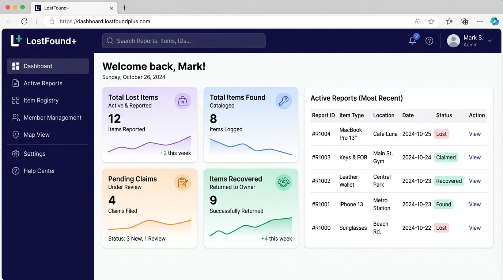
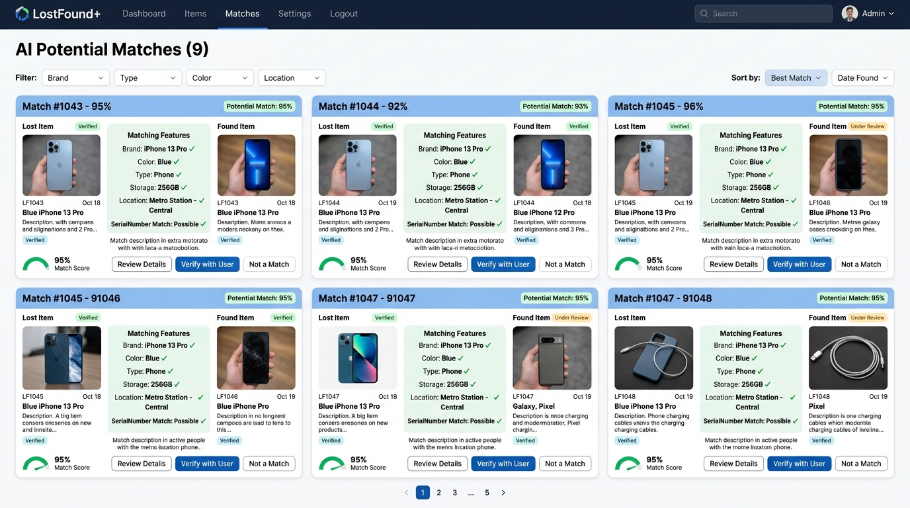
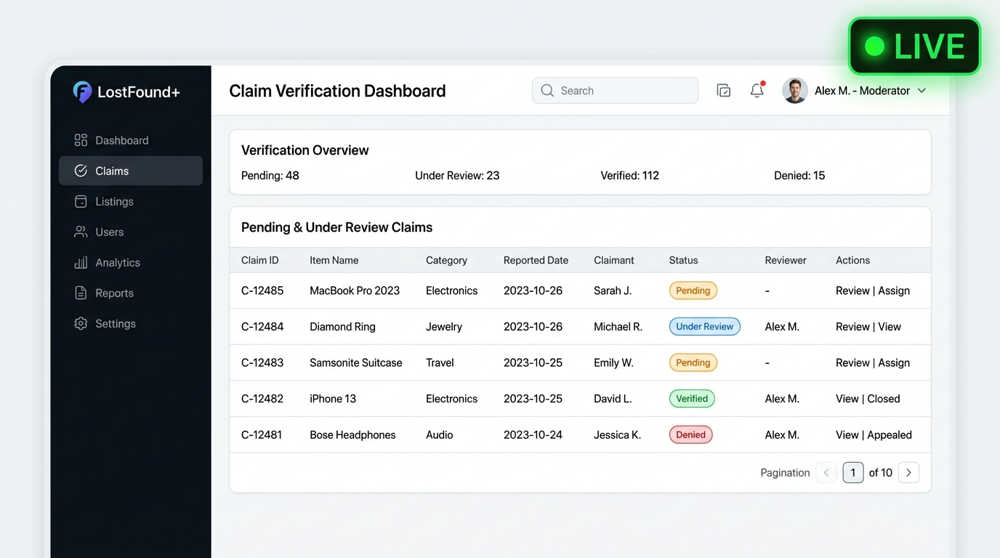

# LostFound+ — Technical Documentation & Blueprint

LostFound+ is an intelligent, real-time, and secure Lost & Found management platform built on the MERN stack. By leveraging custom geolocation matching, real-time WebSocket communication, and rigorous automated fraud scoring, the platform speeds up recoveries while blocking duplicate and fraudulent claims.

---

## 1. Complete Technology Stack & Dependencies

The platform is designed around clean separation of concerns: a React Single Page Application (SPA) on the frontend and an Express REST API + WebSocket server on the backend.

### A. Frontend (Client) Stack
*   **Vite**: The build tool and development server, ensuring rapid HMR (Hot Module Replacement) and optimized bundling.
*   **React (v18)**: Component-based UI rendering.
*   **Tailwind CSS**: Utility-first CSS framework for clean, modern interfaces.
*   **React Router DOM**: Client-side single-page routing, featuring protected routes and lazy loading.
*   **Framer Motion**: Spring-based UI transitions and staggered layout animations.
*   **Axios**: Promise-based HTTP client. Configured with a central class interceptor that attaches credentials automatically.
*   **Socket.io-client**: The client-side WebSocket library to handle instant state synchronizations.
*   **Lucide React**: Vector-based SVG icon system.
*   **React Hot Toast**: Real-time notifications for user actions.
*   **Browser Image Compression**: Client-side Web Worker image compressor that downscales photos below 1MB before sending them over the network.
*   **React Leaflet & Leaflet**: Map components to allow users to interact with locations via click-to-select and marker placements.

### B. Backend (Server) Stack
*   **Node.js**: Server-side runtime environment.
*   **Express.js**: Lightweight framework routing the API endpoints.
*   **Mongoose (MongoDB ORM)**: Schemas, validations, and query abstractions mapping straight to MongoDB Collections.
*   **Socket.io**: Multi-client WebSocket server managing bidirectionally connected sockets.
*   **Jsonwebtoken (JWT) & Bcryptjs**: Standard cryptography pipeline for token generation and secure password hashing.
*   **Cookie-Parser**: Middleware parsing incoming request cookies (enables JWT transport via secure HttpOnly cookies).
*   **Multer & Cloudinary**: Middleware to parse `multipart/form-data` uploads, streaming files directly to Cloudinary CDN storage.
*   **Nodemailer**: SMTP engine sending transactional status alerts.
*   **Compression**: Gzip middleware reducing size of JSON payloads transmitted over HTTP.
*   **Helmet**: Secures HTTP response headers against script injections.
*   **Express Rate Limit**: Implements route-specific rate-limiting rules.

---

## 2. Platform Interface Mockups

### User Dashboard Panel
The dashboard provides a visual overview of platform performance, reporting statistics, active claims, and recent activity.


### AI Potential Matches Grid
Our matching engine processes keywords, colors, and coordinates, presenting high-confidence matches with clear explanations directly to the user.


### Moderator Claim Verification Board
Moderators verify claims in real-time. Features include an active WebSocket status indicator and dynamic verification queues.


---

## 3. Directory Layout & Organization

```
lostfound-plus/
├── client/                      # Frontend Application
│   ├── public/                  # Static assets (favicons, logos)
│   ├── src/
│   │   ├── components/          # Reusable UI layouts, Navbar, Sidebar
│   │   ├── context/             # Global Contexts (AuthContext, SocketContext)
│   │   ├── pages/
│   │   │   ├── Admin/           # Admin Dashboards & User/Mod managers
│   │   │   ├── Moderator/       # Review boards, claims verification dashboards
│   │   │   ├── Public/          # Landing page, Login, Signup, global Search
│   │   │   └── User/            # Personal Dashboards, Matches, MyReports
│   │   ├── services/            # Axios API interceptor configurations
│   │   ├── App.jsx              # Routing and Context Providers mount
│   │   ├── index.css            # Tailwind directives and globals
│   │   └── main.jsx             # React DOM entry point
│   ├── package.json
│   └── vercel.json              # Client routing configuration
│
├── server/                      # Backend REST API & WebSocket Server
│   ├── config/                  # Cloudinary and MongoDB client config
│   ├── controllers/             # Endpoint handler logic split by domain
│   ├── middleware/              # Auth guards, multer upload arrays, rate limits
│   ├── models/                  # Mongoose Schemas (User, Claim, Items, Logs)
│   ├── routes/                  # Express route controllers
│   ├── services/                # Geolocation, NLP Matching, Email, Fraud
│   ├── utils/                   # WebSocket wrappers, in-memory cache helpers
│   ├── index.js                 # Primary HTTP/WS entry point
│   └── package.json
│
└── vercel.json                  # Root monorepo deployment mapping
```

---

## 4. Database Schema & Data Models

### A. User Schema (`server/models/User.js`)
*   `name`: `{ type: String, required: true }`
*   `email`: `{ type: String, required: true, unique: true, index: true }`
*   `passwordHash`: `{ type: String, required: true }`
*   `role`: `{ type: String, enum: ['user', 'moderator', 'admin'], default: 'user' }`
*   `organization`: `{ type: String, default: 'Public' }`

### B. LostItem Schema (`server/models/LostItem.js`)
*   `title`: `{ type: String, required: true }`
*   `description`: `{ type: String, required: true }`
*   `category`: `{ type: String, required: true, index: true }`
*   `brand`: `{ type: String }`
*   `color`: `{ type: String }`
*   `location`: `{ type: String }`
*   `latitude`: `{ type: Number }`
*   `longitude`: `{ type: Number }`
*   `dateLost`: `{ type: Date, required: true }`
*   `status`: `{ type: String, enum: ['OPEN', 'CLAIMED', 'RECOVERED'], default: 'OPEN' }`
*   `reportedBy`: `{ type: mongoose.Schema.Types.ObjectId, ref: 'User', index: true }`
*   `imageUrl`: `{ type: String }`
*   *Indexes*: Text Index on `{ title: "text", description: "text", brand: "text", color: "text" }`

### C. FoundItem Schema (`server/models/FoundItem.js`)
*   Similar schema structure to `LostItem` with:
    *   `dateFound` instead of `dateLost`
    *   `status` enum: `['OPEN', 'CLAIMED', 'RECOVERED']`
    *   `finderName` / `finderContact` info.
*   *Indexes*: Text Index on `{ title: "text", description: "text", brand: "text", color: "text" }`

### D. Claim Schema (`server/models/Claim.js`)
*   `itemId`: `{ type: mongoose.Schema.Types.ObjectId, required: true, index: true }`
*   `itemType`: `{ type: String, enum: ['LostItem', 'FoundItem'], required: true }`
*   `claimantId`: `{ type: mongoose.Schema.Types.ObjectId, ref: 'User', required: true, index: true }`
*   `description`: `{ type: String, required: true }`
*   `proof`: `{ type: String }`
*   `status`: `{ type: String, enum: ['PENDING', 'APPROVED', 'REJECTED'], default: 'PENDING' }`
*   `reviewedBy`: `{ type: mongoose.Schema.Types.ObjectId, ref: 'User' }`

### E. AuditLog Schema (`server/models/AuditLog.js`)
*   `itemId`: `{ type: mongoose.Schema.Types.ObjectId, required: true }`
*   `actorId`: `{ type: mongoose.Schema.Types.ObjectId, ref: 'User', required: true }`
*   `action`: `{ type: String, required: true }`
*   `previousStatus`: `{ type: String }`
*   `newStatus`: `{ type: String }`

---

## 5. REST API Endpoint Registry

All requests are prefixed with `/api`. Access is restricted dynamically using JWT Verification.

### A. Authentication Paths (`/api/auth`)
*   `POST /register`: Registers new user; returns signed HttpOnly cookie.
*   `POST /login`: Logs in user; returns signed HttpOnly cookie.
*   `GET /me`: Returns details of current session user (verified by cookie decryption).
*   `GET /logout`: Wipes user cookies.

### B. Item Services (`/api/lost` and `/api/found`)
*   `POST /`: Creates an item report.
*   `GET /`: Fetches list of items (paginated, supports query variables).
*   `GET /:id`: Retrieves single item detail.
*   `PUT /:id`: Updates item details.
*   `DELETE /:id`: Deletes item.
*   `GET /:id/matches`: Triggers matching service calculation for the item.

### C. Claims Services (`/api/claims`)
*   `POST /`: Submits a claim proof.
*   `GET /`: Lists claims (filtered by user session role).
*   `PUT /:id/status`: Updates claim status (`APPROVED`, `REJECTED`) and triggers automatic competing claims cleanup.

---

## 6. System Intelligence & Automated Pipelines

### A. Location-Aware Matching Service
When searching or compiling potential matches:
1.  **Haversine Distance**: Calculates exact physical separation in kilometers:
    $$\Delta d = 2R \arcsin\left(\sqrt{\sin^2\left(\frac{\Delta \phi}{2}\right) + \cos(\phi_1)\cos(\phi_2)\sin^2\left(\frac{\Delta \lambda}{2}\right)}\right)$$
    If the calculated separation falls below standard thresholds (e.g. 5km), it scores the location match positively.
2.  **Semantic Similarity**: Breaks text titles and descriptions into stems, searching for matches among colors, brand profiles, and key terms.
3.  **Visual Explanations**: Surfaces specific matched facts directly on the UI (e.g., *"Matched Categories: Electronics"*, *"Matched Location: Inside 1.5km"*).

### B. WebSocket Pipeline Architecture
Our wrapper implementation (`server/utils/socket.js`) provides dynamic data synchronizations:
*   **Handshake Guard**: Reads incoming HttpOnly cookies and verifies the signed JWT. Invalid connections are aborted.
*   **Moderator Room broadcasts**: Broadcasts new claim events globally to connected moderator views to update lists in real time.
*   **User Alerts**: Emits updates directly back to users, providing instant alerts when their claims are processed.
